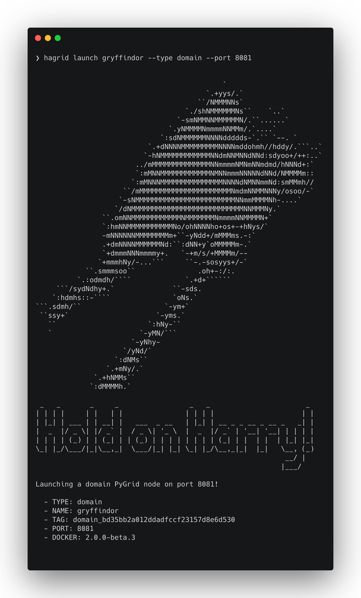

# hagrid

Use this cli to deploy PyGrid Domain and Network nodes on your local machine.

A Hagrid is a HAppy GRID!

## Installation

#### Step 1: Install dependencies
```bash
pip install -r requirements.txt
```

#### Step 2a: Dev Setup
If you want hagrid to launch nodes based on your live-updating codebase, then install it using one of the live-updating install commands. This will mean that the codebase will hot-reload based on the current project. 
```bash
pip install -e .
```
or
```bash
python setup.py develop
```

#### Step 2a: Full Installation (also PyPI)
However, if you aren't actively developing PySyft and/or PyGrid, and you just want to install hagrid, you can also do so using the standard full install commands.
```bash
pip install .
```
or
```bash
python setup.py install
```
This will NOT hot-reload because it'll copy PySyft and PyGrid into a dedicated directory.

## Launch a Node



## A Few Example Commands

Start a node with:
```bash
hagrid launch slytherin
```
... and then stop it with:
```bash
hagrid land slytherin
```
You can specify ports if you want to:
```bash
hagrid launch Hufflepuff House --port 8081
```
... but if you don't it'll find an open one for you
```bash
// finds hufflepuff already has 8081... tries 8082
hagrid launch ravenclaw
```
You can also specify the node type (domain by default)
```bash
hagrid launch gryffendor --type network
```
## Credits

**Super Cool Code Images** by [Carbon](https://carbon.now.sh/)
